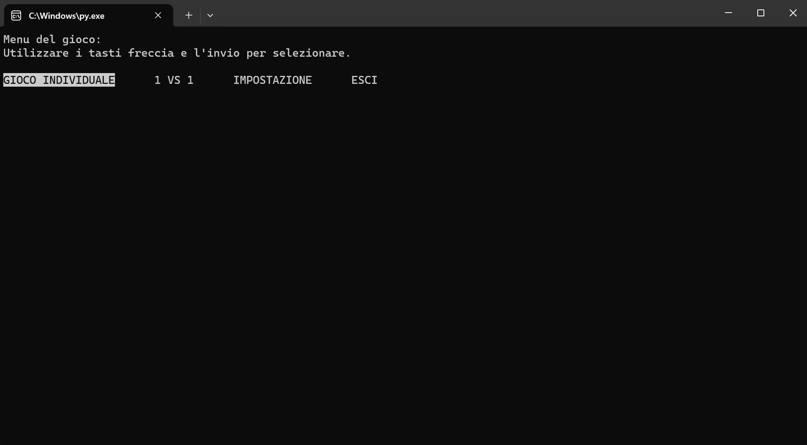

-*- coding: utf-8 -*-

===========================
Il Gioco dell'Impiccato
===========================

Questo è Il Gioco dell'Impiccato, un'applicazione Python che ricrea il classico gioco dell'impiccato. Puoi giocare individualmente contro il computer o sfidare un amico in modalità 1v1.

Requisiti di Sistema (non neccessaria)
------------------------------------------

- Python 3.10.7 (64-bit)
- Sistema operativo: Windows 11

Licenza
--------

Questo progetto è distribuito con la licenza ISC. Per maggiori informazioni, consulta il file LICENSE.md.
:download:`LICENSE <../LICENSE.md>`

Come Eseguire il Gioco
---------------------------

1) Assicurati di avere Python 3.10.7 o versioni successivi installato sul tuo computer.
2) Scarica il file "Il Gioco dell'Impiccato.zip".
3) Estrai il file sul tuo computer.
4) Esegui il file Il Gioco dell'Impiccato.py.